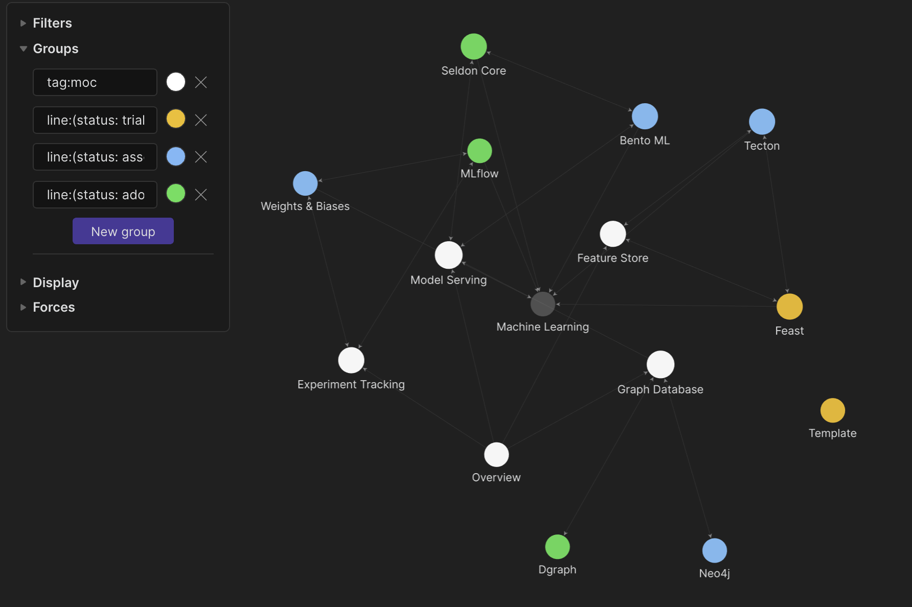
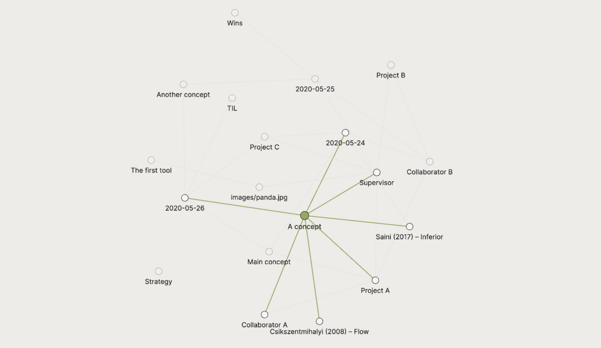
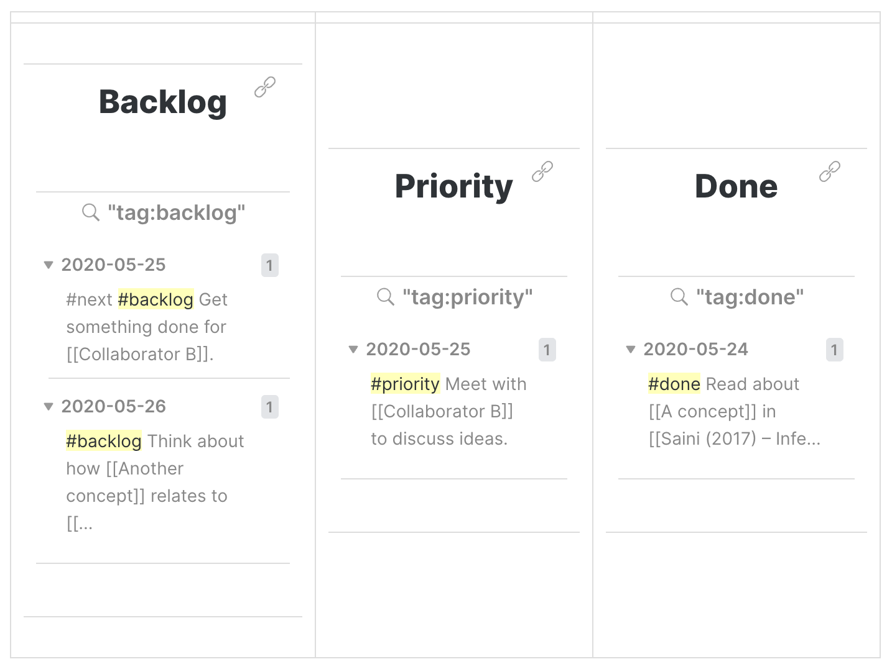
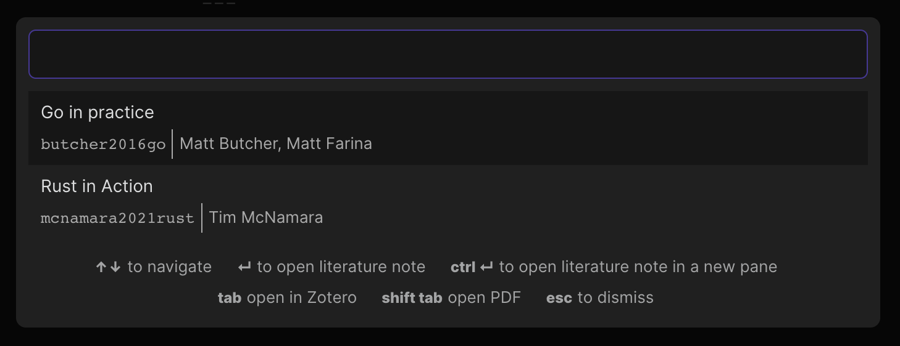
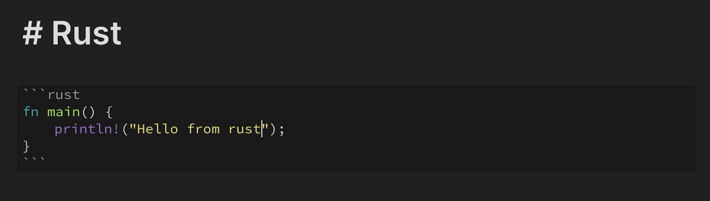

# Obsidian Starter Templates

**Obsidian Starter Templates** is a reference for using [Obsidian](https://obsidian.md/).

If you've tested out [Obsidian](https://obsidian.md/) and worked through the "Obsidian Help" folder, you might be looking for practical strategies to apply associative notes in your daily work.

**Obsidian Starter Templates** gathers examples from the Obsidian [community](https://forum.obsidian.md/). Its broader aims are to uncover and communicate:

1. How others use backlinks and various markdown tricks,
2. Why these techniques work.

The initial example covers how an academic researcher might choose to approach Obsidian.

## Getting started

**Starter Templates** contains template vaults. To get started:

1. Clone the repository and open a vault folder in Obsidian using the "Open another vault" sidebar button.

## Contents

* [Technology Radar](#Technology%20Radar): a template for tracking tools
* [Researcher](#Researcher): general purpose template for research projects
* [Researcher (with plugins)](#researcher-with-plugins): extended template using newer Obsidian community plugins

## Templates

### Technology Radar

Technology Radars are a good way to review tools: for example, tools, techniques, languages, frameworks and platforms (Hewitt, 2019). See the [ThoughtWorks Technology Radar](https://www.thoughtworks.com/radar) for a comprehensive example. 

You can use Obsidian to track the tools that you're currently assessing and learning, noting down why they work for you. In this template, we use a YAML header of the form:

```yaml
---
name: Tool
site: https://tool.io/
status: one of [hold|assess|trial|adopt]
topic: 
 - machine learning
 - frontend
 - systems
history:
  - 2021-03-14: adopt
  - 2021-03-07: assess
---

Additional Markdown content.
```

The YAML header is useful if you want to parse your radar using additional scripting tools. The fields `status` and `history` can be used, for example, to track the progress of each tool through the radar.

#### [Template.md](./technology_radar/Template.md)

You can use a template file to make sure all of your entries are consistent. Adjust the template to your needs, for example by changing the list of topics to one more relevant to your project.

#### [content/](./technology_radar/content)

Use a flat folder structure, where all entries live within a single folder.

#### [Overview.md](./technology_radar/Overview.md)

The overview file is a Map of Content used to categorise the tools.

This example has four additional Maps of Content ([Experiment Tracking](./technology_radar/Experiment%20Tracking.md), [Feature Store](./technology_radar/Feature%20Store.md), [Graph Database](./technology_radar/Graph%20Database.md) and [Model Serving](./technology_radar/Model%20Serving.md)). We can tag each Map of Content using `#moc` within the file so that they are easy to see in the graph visualisation:



In this example, `[[Machine Learning]]` is emerging as a highly linked node: suggesting that we could convert `[[Machine Learning]]` into its own Map of Content.

**TIP:** Visualise the status of each tool using group queries in the graph view, for example `line:(status: trial)`.

### Researcher

The [Researcher](./researcher) template suits a case where you are juggling multiple research projects: for example, reading several books and research papers simultaneously and maintaining multiple collaborations with other researchers. It's nice to have a starter template to experiment with ideas, even though backlinks and associative thinking encourage you to avoid hierarchies and rigid hierarchical structures: see for example Andy Matuschak's [evergreen notes](https://notes.andymatuschak.org/Evergreen_notes), [taxonomy of note types](https://notes.andymatuschak.org/Taxonomy_of_note_types) and [note-link-janitor](https://github.com/andymatuschak/note-link-janitor) project.

#### Example network



The template is intended to be modular. A minimal use could include [scratch/](https://github.com/masonlr/obsidian-starter-templates#scratch) and [concepts/](https://github.com/masonlr/obsidian-starter-templates#concepts), then later expand to [projects/](https://github.com/masonlr/obsidian-starter-templates#projects) and [people/](https://github.com/masonlr/obsidian-starter-templates#people). The intended structure is given by the following tree:

#### [scratch/](./researcher/scratch/)

The scratch folder is an area for messy, low-friction daily free-form planning and logging of ideas, i.e. [scratch/](./researcher/scratch/) will store content generated using the Obsidian "daily notes" feature. Daily notes can be created using the "Open today's note" action: this will create a new markdown file that follows the date-stamped name convention `YYYY-MM-DD.md`.

**TIP:** Set a keyboard shortcut to quickly go to the day's note. For example, set `cmd+T` to "Open today's note" in the Hotkeys settings.  
**TIP:** Create a rigid layout for daily notes by specifying a template markdown file, though a blank template may encourage free-form thinking.

After a few days, daily notes will build up as follows:

- [2020-05-24.md](./researcher/scratch/2020-05-24.md)

- [2020-05-25.md](./researcher/scratch/2020-05-25.md)

- [2020-05-26.md](./researcher/scratch/2020-05-26.md)

  **TIP:** Keep a free-form record of what you're reading, doing and thinking about by linking to concepts and books: this way backlinks in each concept will show that dates on which work was done. Example in [2020-05-24.md](./researcher/scratch/2020-05-24.md):

  ```markdown
  Read about [[A concept]] in [[Saini (2017) – Inferior]]
  ```

  When later reviewing [A concept.md](./researcher/concepts/A%20concept.md), backlinks will show that you were thinking about it on a particular date ([2020-05-24.md](./researcher/scratch/2020-05-24.md)).

  **TIP:** Use tags such as `#backlog` and `#priority` for simple Kanban-style task tracking, see [Distributed idea tracking](https://github.com/masonlr/obsidian-starter-templates#distributed-idea-tracking).

#### [concepts/](./researcher/concepts/)

Folder for "evergreen" concept notes (see Andy Matuschak's [evergreen notes](https://notes.andymatuschak.org/Evergreen_notes)).

- [A concept.md](./researcher/concepts/A%20concept.md)

  An example concept note.

  **TIP:** In a link, it's clearer to read `[[A concept]]` than `[[a-concept]]`, so the filename uses white spaces here and sentence case.

  **TIP:** The filename is more important than the level-one heading. Use a filename appropriate for linking, but use a longer more descriptive level-one heading. Example in [A concept.md](./researcher/concepts/A%20concept.md) where the level-one heading is longer than the filename:

  ```markdown
  # A new concept that is useful
  ```

#### [projects/](./researcher/projects/)

Link ideas, concepts and people to projects.

- [Project A.md](./researcher/projects/Project%20A.md)

  **TIP:** Link to projects from daily notes to keep an informal record of progress. Example in [2020-05-24.md](./researcher/scratch/2020-05-24.md):

  ```markdown
  Got started on ideas about [[Main concept]] for [[Project C]].
  ```

  Project backlinks will then show dates that it was worked on.

  **TIP:** Add links to people and details of their involvement. Example in [Project A.md](./researcher/projects/Project%20A.md):

  ```markdown
  ## People

  - [[Supervisor]]
  - [[Collaborator A]]
  - [[Collaborator B]] might be interested.
  ```

- [Project B.md](./researcher/projects/Project%20B.md)

- [Project C/](./researcher/projects/Project%20C/)

  If a project becomes more complex, it might turn into a folder with many attached concept notes.

  - [Project C.md](./researcher/projects/Project%20C/Project%20C.md)
  - [Main concept.md](./researcher/projects/Project%20C/Main%20concept.md)
  - [Another concept.md](./researcher/projects/Project%20C/Another%20concept.md)

#### [people/](./researcher/people/)

Keep track of interactions with collaborators. If you're doing a research project, you might also have a file for your adviser/supervisor.

- [Collaborator A.md](./researcher/people/Collaborator%20A.md)
- [Collaborator B.md](./researcher/people/Collaborator%20B.md)
- [Supervisor.md](./researcher/people/Supervisor.md)

**TIP:** Link to a person from anywhere if there is an association. You could link from a concept. Example in [A concept.md](./researcher/concepts/A%20concept.md) links to a person from a concept:

```markdown
[[Collaborator A]] has a good idea about this, but [[Supervisor]] thinks that this is wrong.
```

**TIP:** To keep a record of interactions you could link from the daily log. Example in [2020-05-25.md](./researcher/scratch/2020-05-25.md) links from a potential task to a person:

```
#priority Meet with [[Collaborator B]] to discuss ideas.
```

#### [books/](./researcher/books/)

Keep a record of important books here. Each book page could link to a set of relevant concept notes, rather than containing content. If you're undertaking a research project, you could also add an `articles/` folder.

- [Csikszentmihalyi – Flow.md](<./researcher/books/Csikszentmihalyi%20(2008)%20%E2%80%93%20Flow.md>)

  **TIP:** Link to concept pages rather than writing directly in a book page (see Andy Matuschak's [taxonomy of note types](https://notes.andymatuschak.org/Taxonomy_of_note_types)). Example in [Csikszentmihalyi – Flow.md](<./researcher/books/Csikszentmihalyi%20(2008)%20%E2%80%93%20Flow.md>) links from a book to a concept:

  ```markdown
  - One of the chapters focused on [[A concept]]
  ```

  **TIP:** Link from concept pages to book pages. Example in [A concept.md](./researcher/concepts/A%20concept.md):

  ```markdown
  - [[Saini (2017) – Inferior]] described it like this, but [[Csikszentmihalyi (2008) – Flow]] described it like that.
  ```

- [Saini – Inferior.md](<./researcher/books/Saini%20(2017)%20%E2%80%93%20Inferior.md>)

  **TIP:** Link from PDF pages to book pages:

  ```markdown
  - [[Saini (2017) - Inferior.pdf#page=40]] described it.
  ```

#### [tools/](./researcher/tools/)

Think about the tools you're currently using, search for new tools, write notes about what you've learnt.

- [The first tool.md](./researcher/tools/The%20first%20tool.md)

#### [meta/](./researcher/meta/)

Question your approaches here and keep a record of insights and meta concepts.

- [TIL.md](./researcher/TIL.md)

  Use to record today-I-learned ([TIL](https://dictionary.cambridge.org/dictionary/english/til)) style ideas. Example in [2020-05-26.md](./researcher/scratch/2020-05-26.md) links two concepts:

  ```markdown
  [[TIL]] Some interesting idea that stood out. It changed how I thought about [[A concept]] in relation to [[Another concept]].
  ```

  **TIP:** Backlinks to [TIL.md](./researcher/TIL.md) will show a record of when concepts were learnt.

- [Strategy.md](./researcher/meta/Strategy.md)

- [Wins.md](./researcher/meta/Wins.md)

  **TIP:** Keep a record of any milestones or positive feedback.

#### [images/](./researcher/images/)

(optional) You can set a dedicated folder to handle all image uploads: the folder will hold a copy of all images dragged onto Obsidian notes.

- [panda.jpg](./researcher/images/panda.jpg)

  **TIP:** When renaming an image, all links to it will be automatically updated.

#### Distributed idea tracking

Rather than maintaining a list of tasks, distribute the tags across all files so that tags are placed alongside content. Tags can be used to replace simple Kanban-style task tracking. Use whatever tag system works for you – an example idea tags could include:

- `#next`: Must be done next.

  **TIP:** Limit to 2 or 3 instances for a work-in-progress limit.

- `#backlog`: Should be done in the future.

- `#priority`: Should be done soon.

- `#irk`: Must be done soon, but annoying or getting in the way.

- `#lateral`: Interesting left-field idea that may or may not lead anywhere. High-risk, high-reward.

- `#question`: Something uncertain. Plays the role of Wikipedia's [citation needed](https://en.wikipedia.org/wiki/Wikipedia:Citation_needed).

Once an idea has been explored or a task has been finished, delete the tag or add

- `#done`: Done

#### Kanban with embeded queries:

  ```markdown
  |              |                 |           |
  | ------------ | --------------- | --------- |
  | ![[Backlog]] | ![[Priority]] | ![[Done]] |
  ```

Example in `Backlog.md`:

```markdown
​```query
tag:backlog
​```
```



#### Task lists

[Markdown task lists](https://help.github.com/en/github/managing-your-work-on-github/about-task-lists) work well in WYSIWYG editors such as [Typora](https://typora.io/). WYSIWYG editing is on the [Obsidian roadmap](https://trello.com/b/Psqfqp7I/obsidian-roadmap), so may well become a better option than a tag based system.

#### Referencing

For one-off references, pasted links work fine. Example in [A concept.md](./researcher/concepts/A%20concept.md):

```markdown
This concept only appeared once, so just paste link.
https://en.wikipedia.org/wiki/Mental_state
```

If a link occurs multiple times, it might be appropriate to use markdown footnotes and gather a reference list. Example in [A concept.md](./researcher/concepts/A%20concept.md):

```markdown
This link appears many times,[^repeated] so maybe use a footnote.
A reference[^repeated] had an even different idea to [[Csikszentmihalyi (2008) – Flow]].

[[Collaborator A]] has a good idea about this, but [[Supervisor]] thinks that this is wrong. I need to check.[^repeated]

## References

[^repeated]: Flow (psychology): https://en.wikipedia.org/wiki/Flow_(psychology)
```


### Researcher (with plugins)

Since the original [Researcher](#Researcher) template was posted there have been updates to Obsidian, including many community plugins. [Researcher (with plugins)](./researcher_with_plugins) captures several newer ideas and can be viewed as an advanced version of the original [Researcher](#Researcher) template.

#### Maps of Content

A blend of Maps of Content, roadmaps and changelogs is effective for organising multiple projects.

For example:

##### [concepts/](./researcher_with_plugins/concepts/)

Keep one flat structure for all evergreen concept notes.

* [Concept.md](./researcher_with_plugins/concepts/Concept.md)

  An example concept note.

* [Project A](./researcher_with_plugins/concepts/Project%20A.md)

  An example map of content (see [In what ways can we form useful relationships between notes](https://forum.obsidian.md/t/in-what-ways-can-we-form-useful-relationships-between-notes-long-read/702)) for summarising a project.

  **TIP:** If you have multiple projects create additional maps of content, for example Project B and Project C (use more meaningful names though). Keep a flat structure rather than creating dedicated folders for each project.

* [Project A CHANGELOG](./researcher_with_plugins/concepts/Project%20A%20CHANGELOG.md)

  Keep a rough changelog of important completed tasks in your project – many open-source projects use a `CHANGELOG.md` file (see for example [Keep a Changelog](https://keepachangelog.com/)).

* [Project A ROADMAP](./researcher_with_plugins/concepts/Project%20A%20ROADMAP.md)

  Keep a rough sketch of future ideas and plans using a roadmap – many open-source projects use a `ROADMAP.md` (for ideas, check out Mozilla's [Introduction to Roadmapping](https://mozillascience.github.io/working-open-workshop/roadmapping/)).

#### Referencing

##### [references.bib](./researcher_with_plugins/references.bib)

The [Citations](https://github.com/hans/obsidian-citation-plugin) community plugin is great for referencing. If you maintain a list of references in `.bib` format (for example using [Zotero](https://www.zotero.org/) or [BibDesk](https://bibdesk.sourceforge.io/)), you can search references from within Obsidian and, if needed, create a dedicated page for each reference.

**TIP:** You can create a dedicated page for each reference via "Citations: Open literature note" in the Obsidian command palette – create a dedicated Hotkey for this action if you use it often.




You can write short notes (for example, short chapter summaries) on each reference page itself (see [@butcher2016go.md](./researcher_with_plugins/books/@butcher2016go.md)). It can be useful to write longer notes on specific concepts elsewhere, and refer back to the source using Markdown citations: `[[@butcher2016go]`.

**TIP:** You can create a citations using "Citations: Insert Markdown citation" in the Obsidian command palette – create a dedicated Hotkey for this action if you use it often.

#### Backups

Use [Obsidian Git](https://github.com/denolehov/obsidian-git) to configure automatic backups to a remote git repository (e.g. GitHub or GitLab).

#### Templating

##### [templates/](./researcher_v2/templates)

* [Daily.md](./researcher_v2/templates/Daily.md)

  The [Templater](https://github.com/SilentVoid13/Templater) community plugin allows you to create custom daily notes. In this simple example, we have links to yesterday and tomorrow (these links allow you to flick quickly between days when reviewing notes):

  ```markdown
  📆 [[{{tp_yesterday}}]] – [[{{tp_tomorrow}}]]
  ```
#### Syntax highlighting

[Editor Syntax Highlight](https://github.com/deathau/cm-editor-syntax-highlight-obsidian) enables syntax highlighting while in editor mode:




## References

- Hewitt, E, 2019. Technology Strategy Patterns. O'Reilly Media.
- Obsidian: https://obsidian.md/
- Matuschak, A. Evergreen notes: https://notes.andymatuschak.org/Evergreen_notes
- Matuschak, A. Note-link Janitor: https://github.com/andymatuschak/note-link-janitor
- Matuschak, A. Taxonomy of note types: https://notes.andymatuschak.org/Taxonomy_of_note_types
